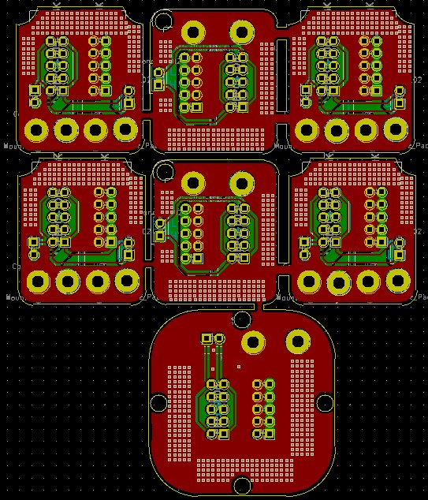
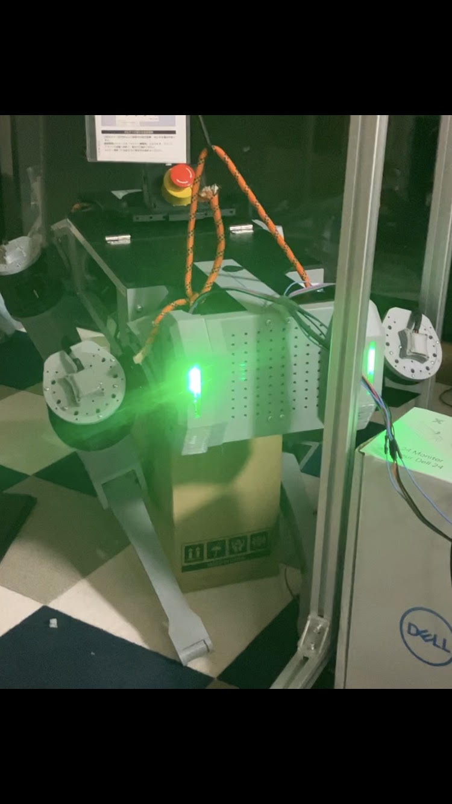

  

# Open Source Quadruped Robot : PSI1 Hardware

## introduction

### what's PSI1?

PSI1 is an open source, fully customizable quadruped robot designed for disaster relief and extreme environments. You can develop your own robot by adding arms to it or wheels to its legs.

  
  

## Hardware
To reduce costs, most parts can be fabricated with a 3D printer.
We use cybergear as an actuator for our robot.
 - Torque is increased across the planetary reducer.
 - A linear actuator with ball screws is created to drive the LOWER LEG.

  
  

You will be required to purchase some metal and other components yourself.

<table>
  <caption>Metal parts that need to be purchased</caption>
  <thead>
    <tr>
      <th>name</th> <th>explain</th>
    </tr>
  </thead>
  <tbody>
    <tr>
      <td>insert-nut m3</td> <td> OD 4.5mm Length 5mm </td>
    </tr>
    <tr>
      <td>insert-nut m5</td> <td> OD 7mm Length 7mm </td>
    </tr>
    <tr>
      <td>ball screw 200mm</td> <td> A lead length of at least 20 mm is recommended </td>
    </tr>
    <tr>
      <td>dowel pin</td> <td> Diameter 5mm, Length 16mm </td>
    </tr>
    <tr>
      <td>bearing1</td> <td> (I.D. O.D. Height)　60×78×10 mm </td>
    </tr>
    <tr>
      <td>bearing2</td> <td>  (I.D. O.D. Height)　35×47×7 mm </td>
    </tr>
    <tr>
      <td>bearing3</td> <td>  (I.D. O.D. Height)　10×22×6 mm </td>
    </tr>
    <tr>
      <td>screw post</td> <td> Diameter 5mm, Length 50mm </td>
    </tr>
    <tr>
      <td>screw post</td> <td> Diameter 5mm, Length 75mm </td>
    </tr>
    <tr>
      <td>m3 screw 8mm</td> <td></td>
    </tr>
    <tr>
      <td>m3 screw 10mm</td> <td></td>
    </tr>
    <tr>
      <td>m3 screw 15mm</td> <td></td>
    </tr>
    <tr>
      <td>m3 screw 20mm</td> <td></td>
    </tr>
    <tr>
      <td>m3 screw 25mm</td> <td></td>
    </tr>
    <tr>
      <td>m3 screw 30mm</td> <td></td>
    </tr>
    <tr>
      <td>m3 screw 50mm</td> <td></td>
    </tr>
    <tr>
      <td>m4 screw 8mm</td> <td></td>
    </tr>
    <tr>
      <td>m4 screw 25mm</td> <td></td>
    </tr>
    <tr>
      <td>m5 screw 15mm</td> <td></td>
    </tr>
  </tbody>
</table>

## Electronics
We built our own connector board to wire the connectors efficiently. We also created an eye LED board to monitor the robot's status.

  
  

When completed and assembled, it looks like the image below.

  
  
  
  

  
  

  <table style="width: 48%; border: 1px solid #000; margin-right: 1%;">
    <caption>connector PCB parts 1</caption>
    <thead>
      <tr>
        <th>name</th> <th>explain</th>
      </tr>
    </thead>
    <tbody>
      <tr>
        <td> Tri-Color LED</td> <td>cannon ball Type</td>
      </tr>
      <tr>
        <td> 8-bit shift register </td> <td>TC74HC595AF</td>
      </tr>
      <tr>
        <td>xh connector 6pin</td> <td></td>
      </tr>
    </tbody>
  </table>

  <table style="width: 48%; border: 1px solid #000;">
    <caption>Eye LED PCB parts 2</caption>
    <thead>
      <tr>
        <th>name</th> <th>explain</th>
      </tr>
    </thead>
    <tbody>
      <tr>
        <td>CONN HERADER VERTICAL</td> <td>SBH11-PBPC-D05-ST-BK</td>
      </tr>
      <tr>
        <td>CONN HERADER VERTICAL</td> <td>SFH11-PBPC-D05-ST-BK</td>
      </tr>
      <tr>
        <td>braided tubing</td> <td> 8mm-13mm</td>
      </tr>

  </table>

## How to assenble
Editing now

## Conclusion
Our ultimate goal is to safely replace work in factories, industrial complexes, nuclear power plants, etc. with robots using inexpensive quadruped robots. Please contact us if you are interested and willing to help us commercialize the robot.
If there are files missing that you need to do your work, please reach out to tokiyusuke0702@gmail.com and we will be happy to discuss how we can provide you with what you require. We love hearing from our community! Software release is in progress, please wait a few minutes

Thanks.
Yusuke Toki, Representative of QUADRO

